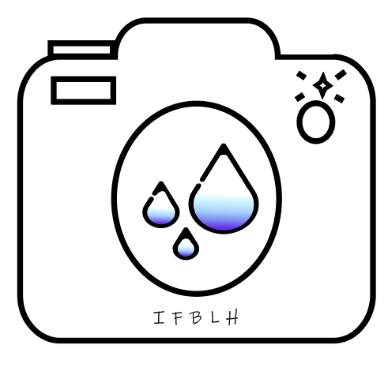

# IFBLH
### Description 
&nbsp;
##### SnapWeather is a weather app that lets users preview the weather through pictures and videos.  The essential function is to take pictures or videos of the weather, and share them with the IFBLH network.

&nbsp; 
# Logo 
&nbsp; 

&nbsp;

| TEAM | ROLES | TASKS 
| ---------  |------------| ---------|
| Elise | web developer |  Phone features 
| Bérengère | web designer  | Design Layout, app,  web app
| Baudouin | web developer | Website features
| Agnès | project manager 2.0 | Logo, Trello 

&nbsp; 
## Fonctionalités 

- [Screen 1](https://github.com/elisemlbr/)

- [Screen 2](htpps://github.com/elisemlbr/)

&nbsp;
## Project Management
[Trello](https://trello.com/invite/b/pb5sMsMt/3bd5267e33790e821ae5e08291ac27ee/ifblh) 
